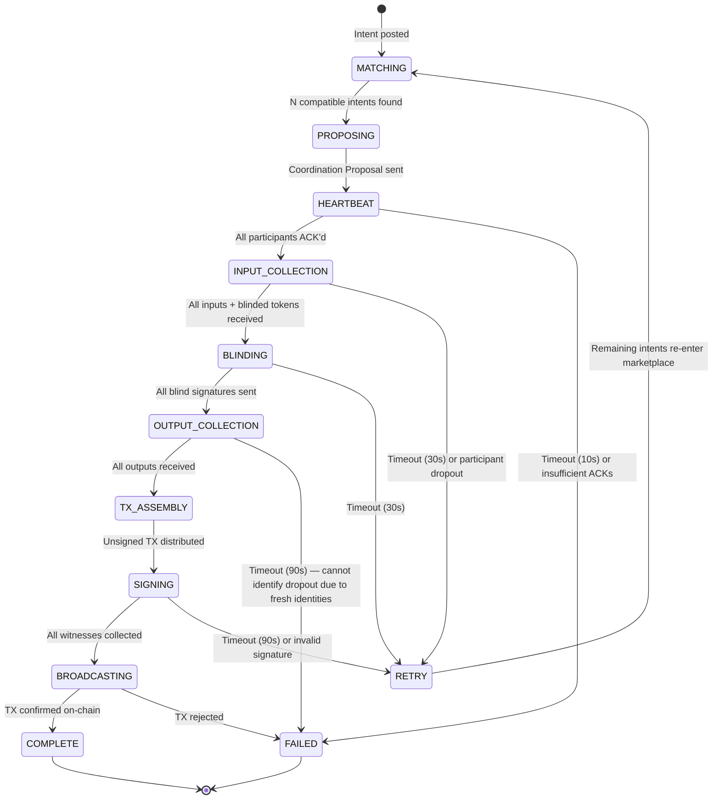

# CONIC (CKB Over Nostr Intent Coordination) MVP Design Spec

## 1. Overview

CONIC is an intent layer for CKB built on top of Nostr. The first feature is a decentralized, P2P CoinJoin-style mixing workflow. The goal is to deliver a functional MVP demonstrating a complete workflow for matching and coordinating privacy-preserving CKB transactions on testnet.

## 2. Architecture: The Intent Marketplace

The CONIC marketplace is a decentralized "ask/bid" system for CKB intents.

### 2.1 Roles

- **Participant (Intent Poster)**: Posts a public intent to the Nostr relay, expressing desire to participate in a CoinJoin mix of a specific amount.
- **Coordinator**: The participant who "completes" a matching set (e.g., the Nth participant for an N-person mix). They take on the coordination role for that round.

### 2.2 Coordination Model

- **Decentralized/P2P**: Any participant can become the Coordinator for a round. There is no dedicated coordinator server.
- **Match Completion**: A participant who observes that enough compatible intents exist (matching amount and `min_participants`) publishes a Coordination Proposal referencing those intents. By doing so, they become the Coordinator.
- **Collision Handling (Tie-Breaking)**: If multiple participants publish competing Coordination Proposals for overlapping intent sets:
  1. Each participant compares the `created_at` timestamps of the proposals they receive.
  2. The proposal with the **lowest `created_at`** wins.
  3. If timestamps are equal, the proposal with the **lexicographically smaller event ID** wins.
  4. Participants who receive a competing proposal with a winning priority **within 5 seconds** of the first proposal MUST switch to the winning Coordinator.
  5. After the 5-second window, participants commit to whichever Coordinator's heartbeat they first respond to.

## 3. Nostr Protocol Definition

We use custom Nostr events to coordinate the marketplace and the mix.

### 3.1 Event Kinds

| Kind    | Name                 | Encryption                  | Purpose                                                                            |
| ------- | -------------------- | --------------------------- | ---------------------------------------------------------------------------------- |
| `30078` | Intent Post          | Plaintext                   | Public intent to join a CoinJoin mix                                               |
| `30078` | Round Commitment     | Plaintext                   | Public commitment binding a coordination round to a specific RSA public key (§4.3) |
| `14`    | Coordination Message | NIP-44 + NIP-59 (Gift Wrap) | All private coordination between Coordinator and participants                      |

### 3.2 Intent Post (Kind 30078)

Uses NIP-78 (Application-specific data) to avoid kind collisions.

- **Content** (JSON):

  ```json
  {
    "type": "ckb-coinjoin",
    "amount": 100000000000,
    "min_participants": 3
  }
  ```

  - `amount`: The exact mix amount in **Shannons** (1 CKB = 10⁸ Shannons, so `100000000000` = 1000 CKB)
  - `min_participants`: Minimum number of participants to form a valid round

- **Tags**:
  - `["t", "ckb-coinjoin"]` — Topic tag for discoverability
  - `["d", "<unique-id>"]` — Deduplication tag (NIP-78 requirement)

### 3.3 Coordination Messages (Kind 14 / Gift Wrap)

All private coordination uses **NIP-17 Private Direct Messages** (which builds on NIP-44 encryption and NIP-59 Gift Wrapping). This hides metadata (sender/recipient) from relays.

#### 3.3.1 Known Limitation: Relay Storage of Kind 14

Kind 14 messages with Gift Wrap are designed to be ephemeral — most relays do not guarantee persistent storage once delivered. This means a participant who goes offline briefly may miss a coordination message if the relay has already discarded it.

**Impact**: If a participant disconnects during an active round (even briefly), they may miss critical messages like `tx_proposal` or `blind_signature`, causing the round to fail unnecessarily.

**MVP Decision**: Accept this limitation. The coordination protocol already handles failures through timeouts and retry behavior (§6). For the testnet MVP, we increase relevant timeouts to reduce the impact:

| Phase                | Default Timeout | Testnet Timeout |
| -------------------- | --------------- | --------------- |
| Output Collection    | 60s             | 90s             |
| Signature Collection | 60s             | 90s             |

Future improvements could include a message re-request mechanism (participant asks Coordinator to re-send the last message), but this is out of scope for MVP.

#### 3.3.2 Message Types

Message types are distinguished by a `type` field in the decrypted content:

| Type                    | Direction                 | Content Fields                                                                    |
| ----------------------- | ------------------------- | --------------------------------------------------------------------------------- |
| `coordination_proposal` | Coordinator → Participant | `matched_intents[]`, `coordinator_pubkey` (coordination_id is derived — see §4.3) |
| `heartbeat`             | Coordinator → Participant | `coordination_id`, `status`                                                       |
| `heartbeat_ack`         | Participant → Coordinator | `coordination_id`                                                                 |
| `input_request`         | Coordinator → Participant | `coordination_id`, `rsa_public_key` (PEM or JWK format)                           |
| `input_submission`      | Participant → Coordinator | `coordination_id`, `inputs[]`, `change_address`, `blinded_token`                  |
| `blind_signature`       | Coordinator → Participant | `coordination_id`, `signed_blinded_token`                                         |
| `output_submission`     | Participant → Coordinator | `coordination_id`, `unblinded_token`, `output_address`                            |
| `tx_proposal`           | Coordinator → Participant | `coordination_id`, `unsigned_tx_hex`                                              |
| `tx_signature`          | Participant → Coordinator | `coordination_id`, `witnesses[]`                                                  |
| `round_complete`        | Coordinator → Participant | `coordination_id`, `tx_hash`                                                      |
| `round_failed`          | Coordinator → Participant | `coordination_id`, `reason`                                                       |

## 4. Privacy Protocol: RSA Blind Signatures (RFC 9474)

To prevent the Coordinator from linking inputs to outputs, we use the **RSA Blind Signature** protocol as specified in [RFC 9474](https://www.rfc-editor.org/rfc/rfc9474.html). Additionally, the protocol uses a **deterministic coordination ID** and **public key commitment** to prevent a malicious Coordinator from deanonymizing participants.

### 4.1 Deterministic Coordination ID

The `coordination_id` is **not chosen by the Coordinator** — it is deterministically derived from the matched intent IDs:

```
coordination_id = sha256(sort([intent_id_1, intent_id_2, ..., intent_id_N]).join(','))
```

Since intent IDs are public Nostr event IDs visible to everyone, every participant can independently compute the same `coordination_id`. The Coordinator **cannot fabricate different values** for different participants.

### 4.2 Public Round Commitment

Before sending private `input_request` messages, the Coordinator MUST publish a **public Round Commitment** event on the relay:

- **Kind**: `30078` (NIP-78 application-specific data)
- **Content** (JSON):
  ```json
  {
    "type": "round-commitment",
    "coordination_id": "<deterministic hash>",
    "matched_intents": ["<intent_id_1>", "<intent_id_2>", "<intent_id_3>"],
    "rsa_pubkey_fingerprint": "<sha256 of the RSA public key in JWK format>"
  }
  ```
- **Tags**:
  - `["t", "ckb-coinjoin-round"]` — Topic tag for discoverability
  - `["d", "<coordination_id>"]` — Deduplication tag (ensures only one commitment per coordination ID)
  - `["e", "<intent_id_1>"]`, `["e", "<intent_id_2>"]`, ... — References to matched intents

The `"d"` tag ensures the event is **parameterized replaceable** (NIP-33): only one event with a given `d` value can exist per pubkey. This prevents the Coordinator from publishing multiple conflicting commitments for the same round.

### 4.3 Participant Verification Checklist

Upon receiving a `coordination_proposal` and `input_request`, each participant MUST perform all of the following checks before proceeding with blinding:

1. **Derive coordination_id**: Compute `sha256(sort(matched_intents).join(','))` from the `matched_intents[]` in the proposal. This MUST equal the `coordination_id` used in all subsequent messages. If it doesn't match → **abort**.
2. **Verify own intent**: Confirm that the participant's own intent ID is in the `matched_intents[]` list. If missing → **abort**.
3. **Find public commitment**: Query the relay for a `Kind 30078` event with tag `["d", "<coordination_id>"]` and `["t", "ckb-coinjoin-round"]`. There MUST be **exactly one** such event. If zero or more than one → **abort**.
4. **Verify RSA key**: Compute `sha256(rsa_public_key_jwk)` from the RSA key received in `input_request`. This MUST equal the `rsa_pubkey_fingerprint` in the public commitment. If it doesn't match → **abort**.

If any check fails, the participant aborts and does not submit inputs or blinded tokens.

### 4.4 Why This Prevents Deanonymization

Without these checks, a malicious Coordinator could:

| Attack                                     | How                                                                | Defense                                                                                                            |
| ------------------------------------------ | ------------------------------------------------------------------ | ------------------------------------------------------------------------------------------------------------------ |
| Different RSA keys per participant         | Send pk₁ to Alice, pk₂ to Bob → link outputs by which key verifies | Public commitment binds ONE key to the round; participants verify fingerprint (§4.3 step 4)                        |
| Different coordination_ids per participant | Send id₁ to Alice, id₂ to Bob → link outputs by coordination_id    | coordination_id is deterministic from public data; participants compute it independently (§4.3 step 1)             |
| Multiple commitment events                 | Publish different commitments for overlapping intent sets          | `d` tag deduplication ensures one commitment per coordination_id; participants check for exactly one (§4.3 step 3) |

### 4.5 Protocol Flow

```
Coordinator                                Participant
    |                                         |
    |  Generates RSA keypair (sk, pk)         |
    |  Publishes Round Commitment (public)    |
    |  --- coordination_proposal (private) -->|
    |  --- input_request + pk (private) ----->|
    |                                         |
    |                                         |  Verification checklist (§4.3):
    |                                         |    1. Derive coordination_id ✓
    |                                         |    2. Own intent in list ✓
    |                                         |    3. Exactly 1 public commitment ✓
    |                                         |    4. RSA key fingerprint matches ✓
    |                                         |
    |                                         |  preparedMsg = Prepare(msg)
    |                                         |  {blindedMsg, inv} = Blind(pk, msg)
    |  <------ input + blindedMsg ----------  |
    |                                         |
    |  blindSig = BlindSign(sk, blindedMsg)   |
    |  ------- blindSig ---------------------->|
    |                                         |
    |                                         |  sig = Finalize(pk, msg, blindSig, inv)
    |                                         |
    |                                         |  === Switch to fresh Nostr identity ===
    |                                         |
    |  <----- output_addr + msg + sig -----   |
    |                                         |
    |  Verify(pk, sig, msg) ✓                 |
    |  Cannot link to original input          |
```

### 4.6 Implementation Details

- **Library**: Use [`@cloudflare/blindrsa-ts`](https://github.com/cloudflare/blindrsa-ts) — a production-grade TypeScript implementation of RFC 9474, maintained by Cloudflare. Supports all four RFC variants and uses the WebCrypto API.
- **Variant**: `RSABSSA.SHA384.PSS.Randomized` (recommended by RFC 9474 for most applications).
- **RSA keypair**: The Coordinator generates a **per-round** RSA keypair (2048-bit modulus). The public key is committed in the public Round Commitment event and distributed to participants in the `input_request` message. This keypair is separate from Nostr and CKB keys.
- **Message (`msg`)**: A unique random token (32 bytes) generated by the participant.
- **Inverse (`inv`)**: The blinding inverse, generated by the `Blind` function and stored client-side until `Finalize`.
- **Fresh identity**: The participant generates a new ephemeral Nostr keypair for the output submission phase. This keypair is used only once and discarded.

## 5. CKB Transaction Structure

- **Fixed-Amount Mix**: All "mixed" outputs in a round have the same denomination (e.g., 1000 CKB).
- **Inputs**: One or more CKB cells per participant, totaling at least `mix_amount + fee_share`.
- **Outputs**:
  - One **mixed output** per participant (the privacy-preserving output at the fixed amount).
  - One **change output** per participant (returning excess to a change address provided in the Input stage).
- **Dust Handling**: If a change output would be less than **61 CKB** (minimum cell capacity), the participant must either:
  1. Provide a larger input to ensure change ≥ 61 CKB, or
  2. Forfeit the dust as an additional fee (no change output is created).
- **Fee Handling**: Transaction fees are split equally among participants. Each participant's share is deducted from their change output.
- **Signing**: Each participant signs only their own inputs using **secp256k1 ECDSA** (CKB's default signing algorithm). The Coordinator distributes the unsigned transaction, collects per-input witnesses, and assembles the final transaction.
- **CKB SDK**: Use [ccc](https://github.com/ckb-devrel/ccc) for transaction construction, signing, and submission.

## 6. Coordination State Machine



### 6.1 Timeouts

| Phase                | Timeout    | On Timeout                                                                                            |
| -------------------- | ---------- | ----------------------------------------------------------------------------------------------------- |
| Heartbeat            | 10 seconds | Exclude non-responsive participants, retry if still ≥ `min_participants`                              |
| Input Collection     | 30 seconds | Exclude non-responsive, retry if still ≥ `min_participants`                                           |
| Blinding             | 30 seconds | Round fails, participants re-enter marketplace                                                        |
| Output Collection    | 90 seconds | **Round fails** — cannot identify who dropped out due to fresh identities; cannot selectively exclude |
| Signature Collection | 90 seconds | Exclude non-signers, retry if still ≥ `min_participants`                                              |

### 6.2 Coordinator Dropout

The Coordinator is also a participant and can go offline. Since the Coordinator drives the state machine, all participants must be able to detect Coordinator failure:

1. After receiving a `coordination_proposal`, participants expect a `heartbeat` message within **10 seconds**.
2. If no heartbeat is received within 10 seconds, participants consider the round **abandoned**.
3. Their original intents remain valid on the relay.
4. Any participant may initiate a new match from the remaining intents, becoming the new Coordinator.

During an active round (after heartbeat), if any Coordinator-initiated message is overdue by **2× the phase timeout**, participants may independently abandon the round and re-enter the marketplace.

### 6.3 Retry Behavior

When a participant drops out:

1. Coordinator publishes a `round_failed` message to all participants with reason.
2. Remaining participants' original intents are still valid on the relay.
3. Any participant (including the former Coordinator) can initiate a new match from the remaining intents.
4. **No automatic re-posting** — participants re-enter the marketplace with their existing intents.

### 6.4 Why Output Collection Cannot Retry

Output Collection is the only phase that **must fail the entire round** on timeout, rather than retrying with remaining participants. This is a fundamental consequence of the privacy model:

```
Fresh identity ──submits──> output_address
                    ↓
Coordinator cannot link fresh identity to original participant
                    ↓
Cannot identify who dropped out
                    ↓
Cannot selectively exclude them
                    ↓
Must fail the whole round
```

This is the intended trade-off: privacy (unlinkability) comes at the cost of round fragility during the output collection phase.

## 7. Configuration

### 7.1 Nostr Relay

For the MVP, use a **single configurable relay** (default: `wss://relay.damus.io`). The relay URL is set via environment variable or UI configuration.

### 7.2 CKB Network

Target **CKB Testnet (Pudge)** for the MVP. Mainnet support is out of scope.

### 7.3 Key Management

- **Nostr keys**: Generated client-side. Stored in browser localStorage, **encrypted with a user-provided password** using AES-256-GCM. Decrypted into memory only when the user unlocks the app. The app also generates ephemeral keypairs for output-stage identity unlinking — these are held in memory only and never persisted.
- **CKB keys**: Imported via private key or mnemonic phrase. Stored in browser localStorage, **encrypted with the same user password** using AES-256-GCM. Decrypted into memory only when needed for transaction signing.
- **Password flow**: On app startup, the user enters a password to decrypt keys into memory. The password itself is never stored. If no keys exist, the user sets a password during initial key generation/import.
- **No relationship** between Nostr keys and CKB keys is required or assumed.

> [!NOTE]
> localStorage encryption is adequate for an MVP but does not protect against XSS attacks. A production version should use a browser extension or hardware wallet for key management.

## 8. Implementation Roadmap (MVP)

| #   | Module                  | Description                                                                      | Dependencies              |
| --- | ----------------------- | -------------------------------------------------------------------------------- | ------------------------- |
| 1   | **Nostr Connector**     | Connect to relay, subscribe to events, publish events. NIP-44/NIP-59 encryption. | `nostr-tools`             |
| 2   | **Intent Marketplace**  | List active intents, post new intents, filter by amount/participants.            | Module 1                  |
| 3   | **Privacy Module**      | RSA blind signature (RFC 9474): prepare, blind, blindSign, finalize, verify.     | `@cloudflare/blindrsa-ts` |
| 4   | **Coordination Engine** | State machine (§6). Message routing. Timeout management.                         | Modules 1, 3              |
| 5   | **CKB Engine**          | Transaction assembly, witness signing, broadcast to testnet.                     | ccc                       |
| 6   | **UI**                  | React components for intent listing, round status, and transaction result.       | Modules 2, 4, 5           |

## 9. Success Criteria

Each criterion must be **demonstrable on CKB Testnet**:

- [ ] **SC-1**: Connect to a Nostr relay and list existing CoinJoin intents (Kind 30078 with tag `ckb-coinjoin`).
- [ ] **SC-2**: Publish a new CoinJoin intent and observe it appearing on the relay.
- [ ] **SC-3**: With 3 participants (can be simulated in separate browser tabs), the 3rd participant triggers a Coordination Proposal and becomes Coordinator.
- [ ] **SC-4**: Complete the full coordination flow (Heartbeat → Inputs → Blinding → Outputs → Signing) to produce a valid signed CKB testnet transaction.
- [ ] **SC-5**: The resulting transaction has 3 outputs of equal value, and the Coordinator cannot determine which output belongs to which input (verified by log inspection — the Coordinator's logs must not contain input-to-output mappings).
- [ ] **SC-6**: Simulate a participant dropout (close tab during Input Collection) and verify the round either retries with remaining participants (if ≥ `min_participants`) or fails gracefully with a `round_failed` message.

## 10. Future Work

### 10.1 Sybil Attack & Reputation System

**Problem**: In the MVP, any Nostr keypair can post intents and participate in rounds. A malicious actor can create many identities (Sybil attack) to:

1. **Dominate rounds** — Fill a round with their own identities, becoming both Coordinator and majority of participants, effectively learning which output belongs to the sole honest participant.
2. **Grief via dropout** — Join rounds with throwaway identities and deliberately drop out during Output Collection (the phase that cannot retry), causing repeated round failures for honest participants.
3. **Statistical deanonymization** — Participate in many rounds with the same honest user, narrowing down output linkage over time through intersection attacks.

**Planned Solution: Nervos DAO Reputation Staking**

Use Nervos DAO deposits as a Sybil-resistance mechanism. Each participant's reputation score is calculated as:

```
reputation = dao_deposit_amount² × deposit_duration
```

- `dao_deposit_amount`: CKB locked in Nervos DAO (in CKB units)
- `deposit_duration`: Time the deposit has been locked (in epochs)
- Squaring the amount makes it quadratically more expensive to split stake across multiple identities

**How it works**:

- Participants include a proof of their Nervos DAO deposit cell in their intent post (referencing the DAO cell's `out_point`).
- Other participants and the Coordinator verify the deposit on-chain.
- Rounds can set a `min_reputation` threshold, filtering out low-stake identities.
- Participants who cause round failures (dropout, invalid signatures) have their reputation penalized in a local blocklist shared across the relay.

**Why this resists Sybil attacks**:

| Strategy                    | Cost without reputation | Cost with reputation (e.g., min 1000 CKB) |
| --------------------------- | ----------------------- | ----------------------------------------- |
| 1 identity, 1000 CKB staked | Free                    | 1000 CKB locked                           |
| 5 identities to fill round  | Free                    | 5000 CKB locked (linear)                  |
| 5 identities, equal score   | Free                    | 11,180 CKB locked (quadratic penalty)     |

> [!NOTE]
> The reputation system is explicitly **out of scope for MVP**. The MVP operates in a trust-assumed testnet environment. Reputation is the first priority for post-MVP hardening.

### 10.2 Other Future Improvements

- **Message re-request protocol**: Participant can ask the Coordinator to re-send missed Kind 14 messages, reducing round failures from relay ephemerality (§3.3.1).
- **Multi-relay support**: Publish events to multiple relays for redundancy and censorship resistance.
- **Variable denominations**: Support multiple mix amounts in the same marketplace (e.g., 100 CKB, 1000 CKB, 10000 CKB tiers).
- **Hardware wallet integration**: Sign CKB transaction witnesses via hardware wallet instead of in-browser keys.
- **Tor integration**: Route fresh-identity output submissions through Tor to prevent relay-level IP correlation.
